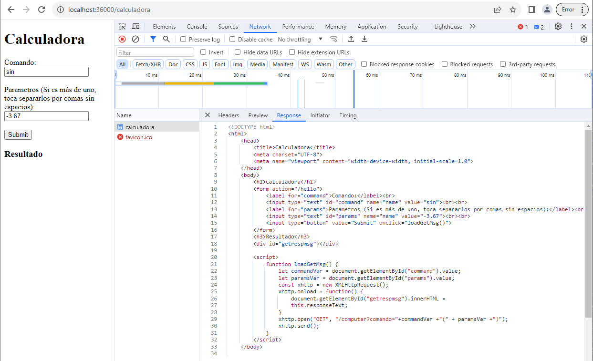
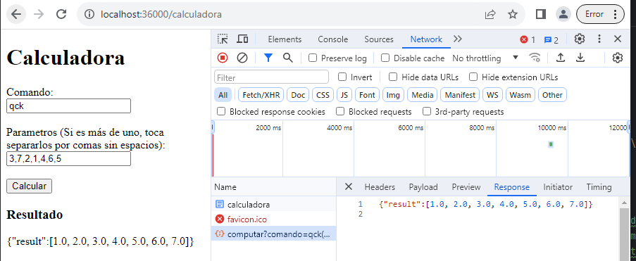
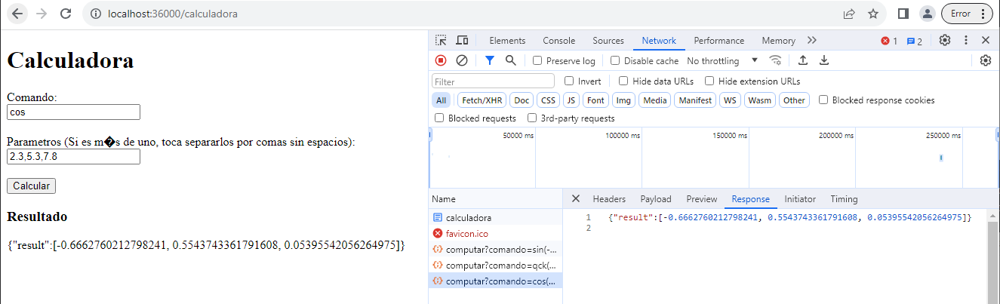

# TALLER DE VERIFICACIÓN DE CONOCIMIENTOS TÉCNICOS

1. Limpiar y compilar el proyecto con:

   ```
   mvn clean install
   ```

2. Se deben correr tanto ReflexCalculator (Puerto 36001) y ServiceFacade (Puerto 36000). Esto se puede hacer con:

   ```
   java -cp target/classes edu.eci.arep.ReflexCalculator
   ```

   ```
   java -cp target/classes edu.eci.arep.ServiceFacade
   ```

3. Para acceder a la calculadora se debe hacer con la URL: http://localhost:36000/calculadora

    

4. En la casilla "Comando" se debe poner la operación que se quiere realizar, puede ser cualquiera de la clase Math de java o el comando "qck". En la casilla Parámetros se debe poner el o los parámetros (Si es más de uno se deben poner separados por comas sin espacios). Seguido a esto se debe oprimir el botón "Calcular".

   

   